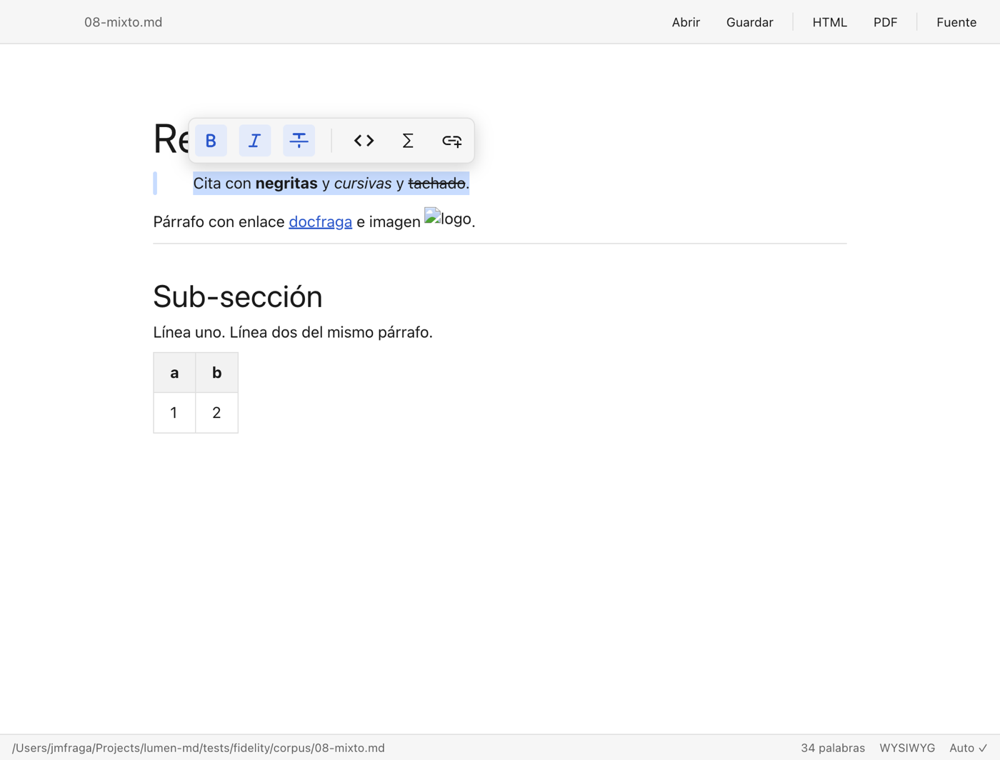
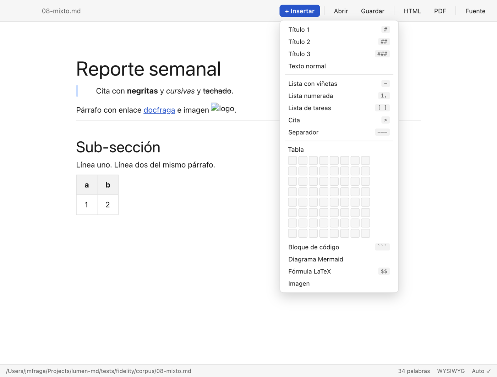
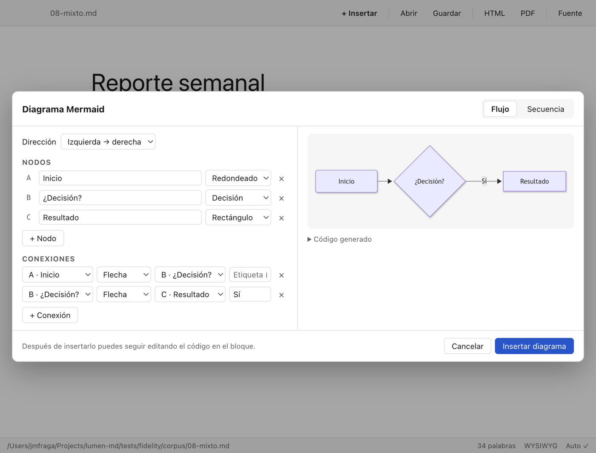
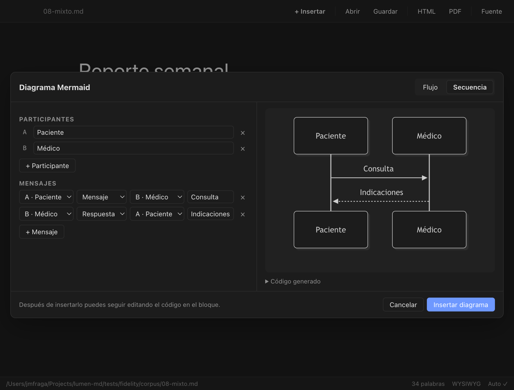

# Lumen

**Lector y editor Markdown que no te rompe las tablas.** Libre, sin cuentas y sin costo, para macOS, Windows y Linux.

Lumen nació para revisar con comodidad los documentos `.md` que generan ChatGPT, Claude, Gemini y compañía: se abren con doble clic y se ven como un documento terminado (tablas, código con colores, diagramas, fórmulas), se editan sin saber Markdown y se guardan como Markdown limpio.



## Descargar

Versión más reciente: **[Releases → latest](https://github.com/jmfraga/lumen-md/releases/latest)**

| Tu computadora                  | Archivo a descargar                                    | Notas                                                             |
| ------------------------------- | ------------------------------------------------------ | ----------------------------------------------------------------- |
| **Mac** (Intel o Apple Silicon) | `lumen-md-x.y.z.dmg`                                   | Universal. Firmado y notarizado por Apple: abre sin advertencias. |
| **Windows** 10/11               | `lumen-md-x.y.z-setup.exe`                             | Instalador. Ver la nota sobre SmartScreen más abajo.              |
| **Linux**                       | `lumen-md-x.y.z.AppImage` o `lumen-md_x.y.z_amd64.deb` | AppImage funciona en cualquier distro; `.deb` para Ubuntu/Debian. |

## Instalar

### Mac

1. Abre el `.dmg` descargado.
2. Arrastra **Lumen** a la carpeta **Aplicaciones**.
3. Abre Lumen desde Aplicaciones o Spotlight. La primera vez macOS puede preguntar si quieres abrir una app descargada de internet: acepta. No aparece la advertencia de "desarrollador no identificado" porque la app está firmada y notarizada.
4. Para que todos tus `.md` se abran con Lumen: clic derecho sobre cualquier archivo `.md` → **Obtener información** → **Abrir con** → Lumen → **Cambiar todo…**

### Windows

1. Ejecuta `lumen-md-x.y.z-setup.exe`.
2. Windows SmartScreen puede mostrar "Windows protegió su PC" porque el instalador no tiene certificado de firma de Windows (es un costo aparte; el código es abierto y puedes revisarlo aquí). Haz clic en **Más información** → **Ejecutar de todas formas**.
3. Sigue el asistente. Puedes elegir la carpeta de instalación.
4. Para abrir `.md` con doble clic: clic derecho sobre un `.md` → **Abrir con** → **Elegir otra aplicación** → Lumen → marca **Usar siempre**.

### Linux

**AppImage** (cualquier distribución):

```bash
chmod +x lumen-md-x.y.z.AppImage
./lumen-md-x.y.z.AppImage
```

Si tu distro no trae FUSE 2, instálalo (`sudo apt install libfuse2` en Ubuntu/Debian) o ejecuta con `--appimage-extract-and-run`.

**Debian / Ubuntu**:

```bash
sudo apt install ./lumen-md_x.y.z_amd64.deb
```

Queda registrado como aplicación para `text/markdown`, así que el doble clic funciona.

### Actualizar

Descarga la versión nueva desde el mismo enlace e instálala encima. Tus preferencias se conservan. Por ahora no hay actualización automática (está en el [roadmap](ROADMAP.md)).

## Para qué sirve

- **Revisar lo que te entregó la IA.** Pides un informe, un plan o un análisis a ChatGPT o Claude, te da un `.md`, lo abres con doble clic y lo lees como documento: la tabla comparativa se ve como tabla, no como una fila de barras verticales.
- **Corregir sin pelearte con la sintaxis.** Cambias una celda, marcas una casilla de tareas, arreglas un título. Guardas y sigue siendo Markdown limpio que puedes devolver a la IA o subir a GitHub.
- **Entregar a quien no lee Markdown.** Exportas a **PDF** para mandarlo por correo o a **HTML** autocontenido (una sola página con todo adentro) para compartirlo.
- **Documentar con diagramas sin aprender Mermaid.** El asistente te pregunta nodos y conexiones, o participantes y mensajes, muestra la vista previa y escribe el código por ti. Después puedes seguir editándolo.
- **Notas con imágenes que viajan con el documento.** Pegas una captura del portapapeles y Lumen la guarda en una carpeta `assets/` junto al `.md`, con ruta relativa. Mueves la carpeta y todo sigue funcionando.
- **Leer memorias, notas de Obsidian y archivos con frontmatter.** El bloque YAML del inicio se muestra como una cabecera plegable y se conserva byte a byte al guardar. Los `[[wikilinks]]` no se rompen.
- **Papers y contenido científico.** Fórmulas LaTeX inline y en bloque, renderizadas con KaTeX.

## Qué hace

- **WYSIWYG** con [Milkdown](https://milkdown.dev): escribes y ves el resultado; las tablas se editan como tablas.
- **Vista de fuente** (`Cmd/Ctrl+/`) con CodeMirror para ver y corregir el Markdown crudo cuando lo necesites.
- **Botón "+ Insertar"** (o escribe `/` en una línea vacía): títulos, listas, cita, separador, tabla con selector de filas y columnas, código, diagrama Mermaid, fórmula e imagen.

  

- **Asistente de diagramas Mermaid** (flujo y secuencia) con vista previa en vivo.

  

- **Tablas GFM, listas de tareas, código con resaltado, Mermaid, KaTeX, frontmatter YAML**.
- **Imágenes** desde el portapapeles o desde archivo, copiadas a `assets/` junto al `.md`.
- **Doble clic** sobre un `.md` lo abre; una ventana por documento; arrastrar y soltar; menú de recientes.
- **Autoguardado** (se apaga en el menú Archivo). Aviso al cerrar si hay cambios sin guardar.
- **Exportar a HTML** autocontenido y **a PDF** (`Cmd/Ctrl+P`).
- Tema claro y oscuro siguiendo el sistema.

  

## Atajos

| Acción                   | Mac                | Windows / Linux           |
| ------------------------ | ------------------ | ------------------------- |
| Nuevo documento          | `⌘N`               | `Ctrl+N`                  |
| Abrir                    | `⌘O`               | `Ctrl+O`                  |
| Guardar / Guardar como   | `⌘S` / `⇧⌘S`       | `Ctrl+S` / `Ctrl+Shift+S` |
| Alternar fuente Markdown | `⌘/`               | `Ctrl+/`                  |
| Exportar a PDF           | `⌘P`               | `Ctrl+P`                  |
| Menú de bloques          | `/` en línea vacía | `/` en línea vacía        |

## Preguntas frecuentes

**¿Modifica mi archivo al abrirlo?** No. Solo escribe cuando editas (autoguardado) o guardas. Un corpus de pruebas verifica que abrir y guardar sin cambios devuelve el mismo Markdown.

**¿Dónde quedan las imágenes que pego?** En una carpeta `assets/` junto al `.md`. El documento debe estar guardado antes para saber dónde está "junto".

**¿Manda algo a internet?** No. Todo corre en tu computadora. Las únicas conexiones son las imágenes con URL externa que tenga tu documento.

**¿Puedo usarlo con Obsidian?** Sí: abre los mismos `.md`; el frontmatter y los `[[wikilinks]]` se conservan.

**Encontré un documento que Lumen altera al guardar.** Es un bug. Abre un [issue](https://github.com/jmfraga/lumen-md/issues) con el archivo (o un fragmento) y lo agregamos al corpus de fidelidad.

## Desarrollo

```bash
npm install
npm run dev        # app con recarga en caliente
npm test           # vitest: fidelidad del round-trip + unitarias
npm run typecheck
npm run build:mac  # o build:win / build:linux
```

Requiere Node 22+. Stack: Electron, React, TypeScript, Milkdown (ProseMirror), CodeMirror 6, Mermaid, KaTeX, unified/remark para exportar.

### Fidelidad del Markdown

`tests/fidelity/corpus/` contiene documentos representativos. Cada uno pasa por
abrir → serializar y debe volver idéntico salvo normalizaciones triviales.
Las diferencias aceptadas se documentan en `tests/fidelity/ALLOWED.md`.
Si tienes un `.md` que Lumen altera al guardar, agrégalo al corpus en un PR.

### Firma y notarización (macOS)

El workflow de release firma y notariza **solo si** existen estos secretos en GitHub
(Settings → Secrets → Actions). Nunca van en el repo.

| Secreto                       | Contenido                                                              |
| ----------------------------- | ---------------------------------------------------------------------- |
| `CSC_LINK`                    | Certificado _Developer ID Application_ en `.p12`, codificado en base64 |
| `CSC_KEY_PASSWORD`            | Contraseña del `.p12`                                                  |
| `APPLE_ID`                    | Apple ID de la cuenta de desarrollador                                 |
| `APPLE_APP_SPECIFIC_PASSWORD` | Contraseña específica de app (appleid.apple.com)                       |
| `APPLE_TEAM_ID`               | Team ID (10 caracteres)                                                |

Sin ellos, el build de macOS sale sin firmar: la primera vez se abre con clic derecho → Abrir.

### Publicar una versión

```bash
npm version patch   # o minor / major
git push --follow-tags
```

El tag `v*` dispara `release.yml`, que construye las tres plataformas y publica el Release (queda como borrador hasta publicarlo a mano).

## Licencia

MIT. Ver [LICENSE](LICENSE). Hecho por [Juan Manuel Fraga](https://docfraga.com) con ayuda de Claude.
